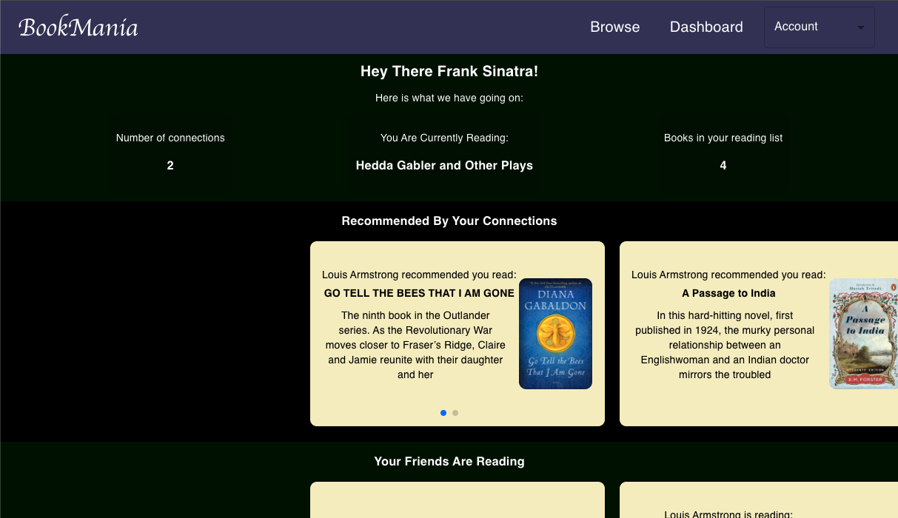
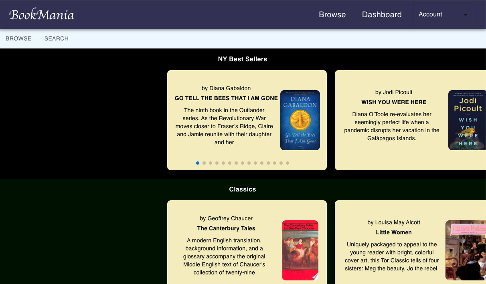
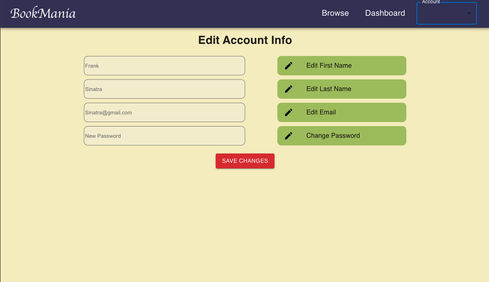
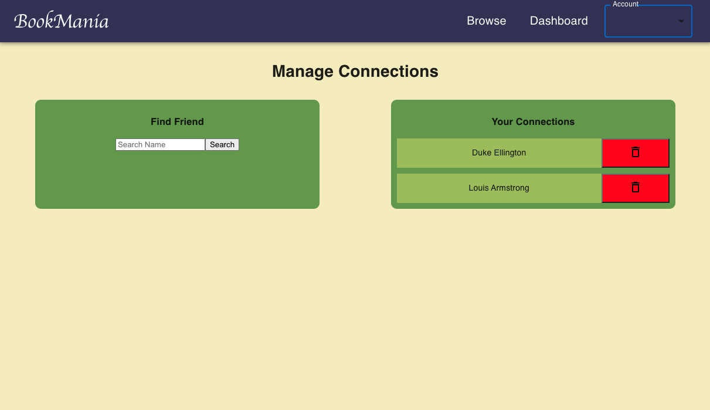

  # Book Mania

  

  ## Description

  A MERN application where a user can create an accound, search for books and create connections. The user can recommend books to their connections and the connections can see what books the user is reading or recommending. This application utilizes the NYT best sellers api as well as google books api. 

  ## Images

  
  ## Table of Content

  * [Installation](#installation)

  * [Usage](#usage)

  * [License](#license)

  * [Contributing](#contributors)

  * [Contact](#questions/contact)

  ## Installation

  To Install necessary dependencies, run the following command:
  
  npm i

  ## Usage

      As you would any other website. There are some accounts created that you can play with or you can use your own account. Feel free to login with an email  of Sinatra@gmail.com and password of password. You can also login with email of Ellington@gmail.com and again password for the password.
  
  ## Technologies

  React, css, javascript, node, mongoose, google book api, NYT book api, express, jsonwebtoken, bcrypt, axios, cors, redux/toolkit.

  ## Contributors

  Ben Hopkins

  ## Questions/Contact

  <a href="https://github.com/bh007183">GitHub Profile</a>
  <a href="mailto:bjhops17@gmail.com"> Email Me</a>
  
  

  